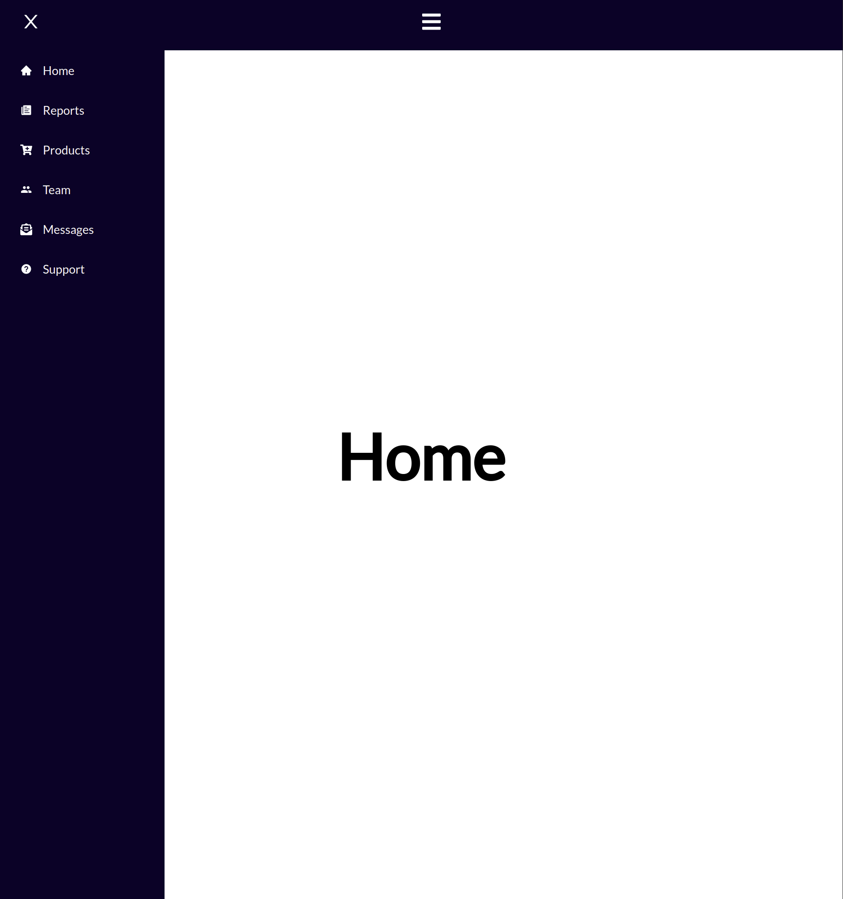

<h1 align="center">
    
</h1>

---

# 📝 About

Just a sidebar navigation with React.js, React Icons and Router.

---

## 🚀 Tecnologias utilizadas

- [Reactjs](https://reactjs.org/)
- [React Router](https://reactrouter.com/)
- [React Icons](https://react-icons.github.io/react-icons/)

---

## 📁 Como baixar o projeto

```bash

    # Clonar o repositório
    $ git clone https://github.com/lrdplopes/navigation-sidebar-reactjs

    #Acessar o repositório
    $ cd navigation-sidebar-reactjs

    #Instalar suas dependências
    $yarn install

    #Iniciar o projeto
    $yarn start

```

---

Será um prazer conectar contigo através das minhas redes sociais:

✔ [Linkedin](https://www.linkedin.com/in/lucasrd-pereira/) <br>
✔ [GitHub](https://github.com/lrdplopes) <br>
✔ [Twitter](https://twitter.com/lrdp_lopes) <br>

---

⚛️ Kind regards,
Lucas Pereira. <br>
